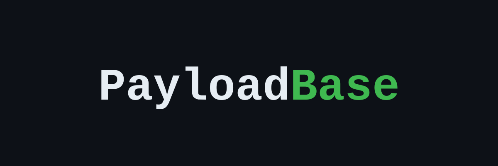

 
### About PayloadBase

A focused payload collection for web application security testing.
Organized by OWASP Top 10:2025 with CWE mapping — load any file directly into Burp, ffuf, nuclei, or gobuster.

Maintained by [ayodyadsr](https://github.com/ayodyadsr)

- - -

### Repository Details


[](https://github.com/ayodyadsr/PayloadBase/commits/main)
[](LICENSE)

- - -

### Install

**Zip**
```bash
wget -c https://github.com/ayodyadsr/PayloadBase/archive/main.zip -O PayloadBase.zip && unzip PayloadBase.zip && rm -f PayloadBase.zip
```

**Git (shallow)**
```bash
git clone --depth 1 https://github.com/ayodyadsr/PayloadBase.git
```

**Git (full)**
```bash
git clone https://github.com/ayodyadsr/PayloadBase.git
```

- - -

### Structure

```
PayloadBase/
├── A01:2025 - Broken Access Control/
├── A02:2025 - Security Misconfiguration/
├── A03:2025 - Software Supply Chain Failures/
├── A04:2025 - Cryptographic Failures/
├── A05:2025 - Injection/
├── A06:2025 - Insecure Design/
├── A07:2025 - Authentication Failures/
├── A08:2025 - Software or Data Integrity Failures/
├── A09:2025 - Security Logging and Alerting Failures/
└── A10:2025 - Mishandling of Exceptional Conditions/
```

- - -

### Categories

**A01:2025 — Broken Access Control**

| CWE | Category | Description |
|---|---|---|
| CWE-287 | `OAuth` | Core endpoints, SAML, social login callbacks, `.well-known`, token management, PKCE bypass |
| CWE-347 | `JWT` | Weak secrets, `alg:none`, RS256→HS256 confusion, framework defaults, breach lists |
| CWE-352 | `CSRF` | Token bypass, SameSite tricks, HTML/fetch/multipart PoC templates |
| CWE-601 | `Open Redirect` | Protocol bypass, @ tricks, domain confusion, encoding bypass, parameter name wordlist |
| CWE-620 | `Account Takeover` | Password reset poisoning, token/session hijacking, OAuth-based ATO, 2FA bypass |
| CWE-639 | `IDOR` | Numeric IDs, UUID variants, object-specific IDs, parameter pollution, GraphQL IDOR |
| CWE-840 | `Business Logic` | Price manipulation, currency confusion, workflow bypass, replay attacks, 2FA skip |
| CWE-915 | `Mass Assignment` | Privilege escalation parameters, framework-specific payloads (Rails, Laravel, Django, Spring) |

**A02:2025 — Security Misconfiguration**

| CWE | Category | Description |
|---|---|---|
| CWE-183 | `Virtual Hosts` | VHost discovery wordlist — internal, cloud, and environment-specific subdomains |
| CWE-200 | `Hidden Params` | Debug flags, admin escalation, role injection, framework-specific parameters |
| CWE-235 | `HTTP Parameter Pollution` | Duplicate parameter behavior across servers, prototype pollution via HPP, WAF bypass |
| CWE-284 | `API Security` | Key testing, versioning bypass, content-type confusion, mass assignment, endpoint discovery |
| CWE-284 | `Insecure Management Interface` | Admin panel paths, framework consoles (Actuator, phpMyAdmin), monitoring tools |
| CWE-346 | `DNS Rebinding` | Attack flow, JS payload, Singularity framework reference, internal service targets |
| CWE-441 | `Reverse Proxy Misconfigurations` | Nginx off-by-slash, path normalization, internal access via header abuse |
| CWE-444 | `Request Smuggling` | CL.TE, TE.CL, TE.TE obfuscation, HTTP/2 downgrade (H2.CL / H2.TE) |
| CWE-525 | `Web Cache Deception` | Static extension path manipulation, cache poisoning via unkeyed headers |
| CWE-942 | `CORS Misconfiguration` | Origin reflection, bypass techniques, dangerous header combinations |

**A03:2025 — Software Supply Chain Failures**

| CWE | Category | Description |
|---|---|---|
| CWE-427 | `Dependency Confusion` | Internal package name discovery, malicious postinstall strategy (npm/pip/gem) |

**A04:2025 — Cryptographic Failures**

| CWE | Category | Description |
|---|---|---|
| CWE-200 | `API Key Leaks` | Regex patterns (AWS, GCP, GitHub, Stripe, OpenAI, Slack); common leak locations |
| CWE-338 | `Insecure Randomness` | Weak PRNG patterns, UUID v1 analysis, PHP `mt_rand()` prediction, time-based token brute force |
| CWE-359 | `XS-Leak` | Frame count oracle, history API, `onload/onerror` oracle, timing, postMessage |
| CWE-540 | `Insecure Source Code Management` | Git/SVN/Mercurial exposure paths, CI/CD config files, backup files |

**A05:2025 — Injection**

| CWE | Category | Description |
|---|---|---|
| CWE-20 | `GraphQL` | Endpoint paths, introspection bypass, query/mutation names, sensitive fields, DoS |
| CWE-22 | `Directory Traversal` | Unix/Windows path traversal, encoding bypass (URL, double-URL, unicode, null byte) |
| CWE-22 | `LFI` | Path traversal, null byte bypass, Windows LFI, RFI, log poisoning, LFI-to-RCE chains |
| CWE-74 | `Mutation` | XSS (Cloudflare/ModSecurity), SQLi encoding, path traversal variants, HTTP smuggling |
| CWE-74 | `Polyglot` | Multi-context payloads combining XSS/HTML/JS/SSTI/SQLi/LFI |
| CWE-78 | `Command Injection` | Unix/Windows — basic, chaining, OOB, time-based, filter bypass, context-specific |
| CWE-79 | `CSS Injection` | Property injection, `@import` SSRF, attribute selector-based data exfiltration |
| CWE-79 | `DOM Clobbering` | Global variable override, multi-level clobbering via `form+input`, CSP bypass |
| CWE-79 | `XSS` | Reflected, stored, DOM, blind, polyglot, CSP bypass, Angular template, exfiltration |
| CWE-89 | `ORM Leak` | Django filter traversal, Rails ActiveRecord ransack/scope injection |
| CWE-89 | `SQL Injection` | Boolean, time-based, error-based, OOB, WAF bypass; MySQL, MSSQL, PostgreSQL, Oracle, SQLite |
| CWE-90 | `LDAP Injection` | Authentication bypass, blind character extraction, filter escape |
| CWE-91 | `XSLT Injection` | SSRF via `document()`, RCE via Saxon, Xalan, MSXSL, PHP `registerPHPFunctions` |
| CWE-93 | `CRLF` | Header injection, redirect injection, response splitting |
| CWE-94 | `LaTeX Injection` | File read via `\input`, RCE via `\write18`, SSRF via `document()` |
| CWE-97 | `Server Side Include Injection` | `exec`, `include`, `printenv` — file read and RCE via SSI directives |
| CWE-116 | `Encoding Transformations` | URL encoding, double encoding, unicode normalization, homoglyphs, HTML entities, Base64/Hex |
| CWE-611 | `XXE` | File read, SSRF, blind OOB, XInclude, SVG/SOAP vectors, PHP filter chains |
| CWE-643 | `XPath Injection` | Authentication bypass, blind extraction via XPath string functions |
| CWE-693 | `Bypass` | WAF bypass — Cloudflare, Akamai, ModSecurity, F5 ASM; method override, header tricks |
| CWE-918 | `SSRF` | Cloud metadata (AWS/GCP/Azure/DO/Oracle/Alibaba), bypass, internal services, Kubernetes, Redis |
| CWE-943 | `NoSQL Injection` | MongoDB operator injection, Redis/CouchDB/Elasticsearch payloads |
| CWE-1236 | `CSV Injection` | Formula injection (DDE) targeting Excel and Google Sheets |
| CWE-1321 | `Prototype Pollution` | Client-side and Node.js server-side gadgets |
| CWE-1336 | `Prompt Injection` | Direct, indirect (document/email), jailbreaks, system prompt extraction |
| CWE-1336 | `SSTI` | Jinja2, Twig, Freemarker, Velocity, Pebble, ERB, Smarty, Mako, Handlebars, EJS, Nunjucks |

**A06:2025 — Insecure Design**

| CWE | Category | Description |
|---|---|---|
| CWE-362 | `Race Condition` | HTTP/2 single-packet attack, Turbo Intruder patterns, TOCTOU scenarios |
| CWE-400 | `Denial of Service` | ReDoS patterns, XML billion laughs, GraphQL depth DoS, hash collision, zip bomb |
| CWE-434 | `File Upload` | Extension bypass, MIME type spoofing, magic bytes polyglot, web shells, path traversal via filename |
| CWE-919 | `Mobile` | Base paths, push endpoints, deep links, versioning, IAP, user agents, sync, device management |
| CWE-1021 | `Clickjacking` | Transparent iframe PoC, sandbox bypass, reverse tabnabbing |
| CWE-1022 | `Tabnabbing` | `window.opener` abuse, delayed redirect, opener document write |
| CWE-1385 | `WebSockets` | CSWSH PoC, handshake header injection, SQLi/SSRF/XSS via WebSocket message |

**A07:2025 — Authentication Failures**

| CWE | Category | Description |
|---|---|---|
| CWE-290 | `SAML Injection` | XML signature wrapping (XSW), XXE in SAML response, attribute and condition tampering |
| CWE-307 | `Brute Force Rate Limit` | IP spoofing headers, OTP bypass, password spray wordlist |

**A08:2025 — Software or Data Integrity Failures**

| CWE | Category | Description |
|---|---|---|
| CWE-22 | `Zip Slip` | Malicious `.zip`/`.tar`/`.jar` — overwrites files outside extraction directory |
| CWE-502 | `Insecure Deserialization` | Java ysoserial gadgets, PHP PHPGGC, Python pickle, .NET BinaryFormatter, Node.js node-serialize |
| CWE-843 | `Type Juggling` | PHP loose comparison magic hashes, `strcmp()` bypass; JavaScript type coercion |

**A09:2025 — Security Logging and Alerting Failures**

No dedicated payload category — this class is typically tested via behavioral observation rather than input payloads.

**A10:2025 — Mishandling of Exceptional Conditions**

No dedicated payload category — covers improper error handling, unhandled exceptions, and verbose stack traces leaking sensitive information.

- - -

### Contributing

Pull requests are welcome. Open an issue first for major additions or structural changes.

See [CONTRIBUTING.md](CONTRIBUTING.md) for guidelines.

- - -

### Disclaimer

For authorized security testing and educational use only. Only test systems you own or have explicit written permission to assess. The maintainer takes no responsibility for misuse.

- - -

### License

[MIT](LICENSE)
